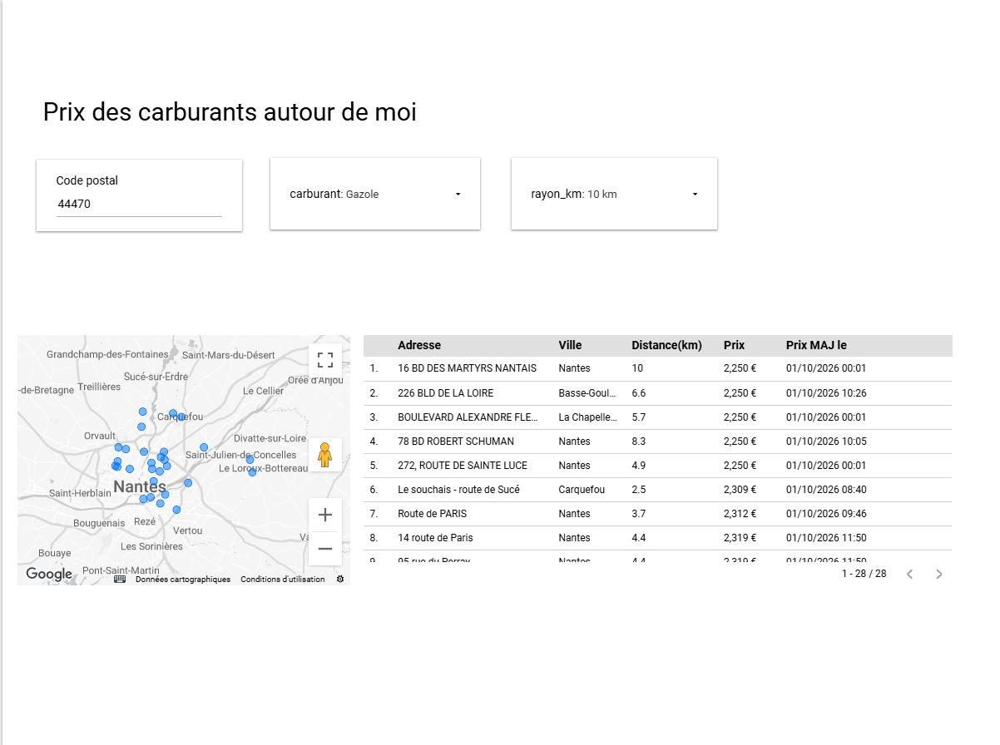
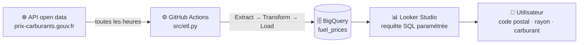

# ⛽ Fuel Price Tracker France

> **Trouvez la station la moins chère autour de vous, avec des prix mis à jour toutes les heures.**
> Pipeline de données automatisé : open data gouvernemental → BigQuery → Looker Studio.


---

## 🎯 Objectif

Le prix d'un même carburant peut varier de **plus de 20 centimes par litre** entre des stations distantes de quelques kilomètres.
Ce projet répond à une question simple :

> *« Où faire le plein au meilleur prix, près de chez moi, aujourd'hui ? »*

L'utilisateur saisit un **code postal**, choisit un **rayon** (5 / 10 / 15 km) et un **carburant**,
et obtient la liste des stations classées du prix le plus bas au plus élevé, avec leur position sur une carte.

---

## 📊 Le dashboard

👉 **[Ouvrir le dashboard Looker Studio](https://datastudio.google.com/reporting/9b5f5714-9fa5-41d2-a50d-8be26e03463f)**



| Fonctionnalité | Détail |
|---|---|
| 📍 Recherche par code postal | Stations dans un rayon de 5, 10 ou 15 km |
| ⛽ 6 carburants | Gazole, E10, SP98, SP95, E85, GPLc |
| 🏆 Classement intelligent | Prix récents d'abord, du moins cher au plus cher |
| ⚠️ Prix obsolètes signalés | Prix non mis à jour depuis plus de 7 jours → relégués en fin de liste |
| 🔴 Ruptures visibles | Les ruptures temporaires sont affichées, les stations qui ne vendent pas le carburant sont masquées |
| 🗺️ Carte interactive | Localisation de chaque station |

---

## 🏗️ Architecture



**Deux tables dans BigQuery :**

| Table | Contenu | Mode d'écriture | Usage |
|---|---|---|---|
| `instantane` | 1 ligne par station (~9 800) | Écrasée à chaque exécution | Dashboard « autour de moi » |
| `historique` | Prix moyen par carburant × type de route | Ajout à chaque exécution | Suivi de l'évolution dans le temps |

---

## 🧰 Stack technique

| Étape | Outil | Points clés |
|---|---|---|
| 📥 Extraction | Python, `pandas` | Appel à l'API d'export CSV, sélection des seules colonnes utiles |
| 🔧 Transformation | `pandas` | Typage, conversion des coordonnées et des fuseaux horaires, agrégation (`melt`, `groupby`) |
| 📤 Chargement | `google-cloud-bigquery` | `WRITE_TRUNCATE` pour le snapshot, `WRITE_APPEND` pour l'historique |
| ⏰ Orchestration | GitHub Actions | Exécution planifiée (`cron`) + déclenchement manuel |
| 🧮 Calculs géographiques | BigQuery SQL | `ST_GEOGPOINT`, `ST_DISTANCE`, `ST_DWITHIN`, `ROW_NUMBER()` |
| 📊 Visualisation | Looker Studio | Requête personnalisée avec 3 paramètres, carte, mise en forme conditionnelle |

---

## 📁 Structure du dépôt

```
fuel-price-tracker-france/
├── .github/workflows/
│   └── update.yml        # ⏰ planification horaire
├── src/
│   └── etl.py            # ⚙️ pipeline Extract → Transform → Load
├── docs/
│   └── dashboard.png     # 🖼️ capture du dashboard
├── requirements.txt      # 📦 dépendances Python
└── README.md
```

---

## 🔍 Qualité des données : ce que j'ai appris en creusant

Une grande partie du travail n'a pas été d'écrire du code, mais de **comprendre et questionner les données**.

### 1. 🕳️ Les valeurs manquantes n'ont pas toutes le même sens

Un prix vide peut signifier trois choses très différentes :

| Cas | Signification | Traitement |
|---|---|---|
| Rupture **temporaire** | La station vend ce carburant, mais n'en a plus | Affiché « Rupture » |
| Arrêt **définitif** | La station a cessé de le vendre | Masqué |
| Jamais proposé | La station ne l'a jamais vendu | Masqué |

➡️ Sans cette distinction, un carburant peu répandu comme le GPLc (≈ 85 % de valeurs vides) aurait donné l'impression d'une pénurie générale.

### 2. ⏳ Un prix présent n'est pas forcément un prix fiable

Certaines stations ne mettent pas leur prix à jour pendant plusieurs semaines.
Un prix vieux de 3 semaines peut apparaître comme « le moins cher » alors qu'il ne l'est plus.

➡️ Les prix de plus de **7 jours** sont signalés par ⚠️ et classés après les prix récents.

### 3. 🕐 Un fuseau horaire erroné dans la source

Les dates de mise à jour sont annoncées en UTC (`+00:00`), mais correspondent en réalité à l'**heure de Paris**.
Le problème a été détecté grâce à une incohérence : certains prix semblaient mis à jour… **après** la collecte des données.

➡️ Correction dans le pipeline : suppression du fuseau erroné, localisation en `Europe/Paris`, puis conversion en UTC avant le chargement.

### 4. 🧭 Déduire le département à partir de l'identifiant

L'identifiant de chaque station commence par son code postal. Pour les rares stations sans département renseigné, celui-ci peut être déduit, avec deux exceptions :

- 🏝️ **Corse** : les codes postaux commencent tous par `20`, mais il existe deux départements (`2A` / `2B`)
- 🌴 **Outre-mer** : codes départements à 3 chiffres (`971`, `974`…)

➡️ La règle Corse a été **testée sur les 126 stations corses** dont le département est connu : **99,2 %** de bonnes réponses. La seule exception s'explique vraisemblablement par un code postal de type CEDEX.

---

## 💡 Quelques constats

- 🛣️ **Surcoût autoroute** : le Gazole coûte environ **8 centimes de plus par litre** sur autoroute (mesuré début octobre 2026, soit ~4 € pour un plein de 50 L).
- 📐 **Attention aux petits échantillons** : certains carburants ne sont proposés que par une dizaine de stations d'autoroute ; une moyenne calculée sur si peu de points n'est pas interprétable.
- 🔄 **Le SP95 recule au profit de l'E10** : beaucoup de stations ont définitivement arrêté le SP95.

---

## 🚀 Reproduire le projet

<details>
<summary><b>Voir les étapes</b></summary>

1. **Google Cloud**
   - Créer un projet et un dataset BigQuery `fuel_prices` (région `EU`)
   - Créer un compte de service avec les rôles **BigQuery Job User** et **BigQuery Data Editor**
   - Générer une clé JSON

2. **GitHub**
   - Forker ce dépôt
   - Ajouter la clé dans *Settings → Secrets and variables → Actions* sous le nom `GCP_SA_KEY`
   - Modifier `PROJECT_ID` dans `src/etl.py`

3. **Lancer le pipeline**
   - Onglet *Actions* → *Mise à jour des prix carburants* → *Run workflow*
   - Les tables `instantane` et `historique` sont créées automatiquement au premier lancement

4. **Exécution en local** (optionnel)
   ```bash
   pip install -r requirements.txt
   export GCP_SA_KEY="$(cat chemin/vers/cle.json)"
   python src/etl.py
   ```

</details>

---

## 🔐 Sécurité

- 🔑 La clé du compte de service est stockée dans **GitHub Secrets**, jamais dans le code (`*.json` est exclu par `.gitignore`)
- 🧱 **Principe du moindre privilège** : le compte de service ne peut qu'exécuter des jobs et écrire dans le dataset du projet
- 🗂️ Projet Google Cloud **dédié**, isolé de tout autre projet

---

## ⚠️ Limites

- ⛽ La source ne distingue que les **6 carburants réglementaires** : les gammes premium (Excellium, V-Power…) ne sont pas identifiables.
- 📍 Le centre de recherche est la **position moyenne des stations** du code postal : un code postal sans station ne renvoie aucun résultat, et un code postal avec une seule station est centré sur celle-ci.
- 🕐 Les prix dépendent des déclarations des stations : un prix peut être obsolète même s'il est présent (d'où le signalement ⚠️).

---

## 🛣️ Évolutions possibles

- [ ] 📮 Utiliser la base officielle des codes postaux pour le centre de recherche
- [ ] 🛣️ Afficher ou filtrer les stations d'autoroute
- [ ] 📈 Ajouter une page d'évolution des prix à partir de la table `historique`
- [ ] 🔐 Remplacer la clé JSON par **Workload Identity Federation** (authentification sans clé longue durée)
- [ ] 🧪 Ajouter des tests unitaires sur les fonctions de transformation

---

## 👩‍💻 Auteure

**Xiaoqing ZHOU GRANDCOING** · 

Projet personnel, né du prolongement d'un cas d'étude réalisé en formation : j'ai voulu passer d'une **analyse ponctuelle** à un **outil automatisé et utilisable au quotidien**.

🔗 [LinkedIn](https://www.linkedin.com/in/xiaoqingzhougrandcoing) · 💻 [GitHub](https://github.com/XiaoqingGdc)

---

<sub>📄 Données : [Prix des carburants en France – Flux instantané v2](https://www.data.gouv.fr/fr/datasets/6407d088d4e23dc662022e2c), Ministère de l'Économie, licence ouverte. · Code sous licence MIT.</sub>
